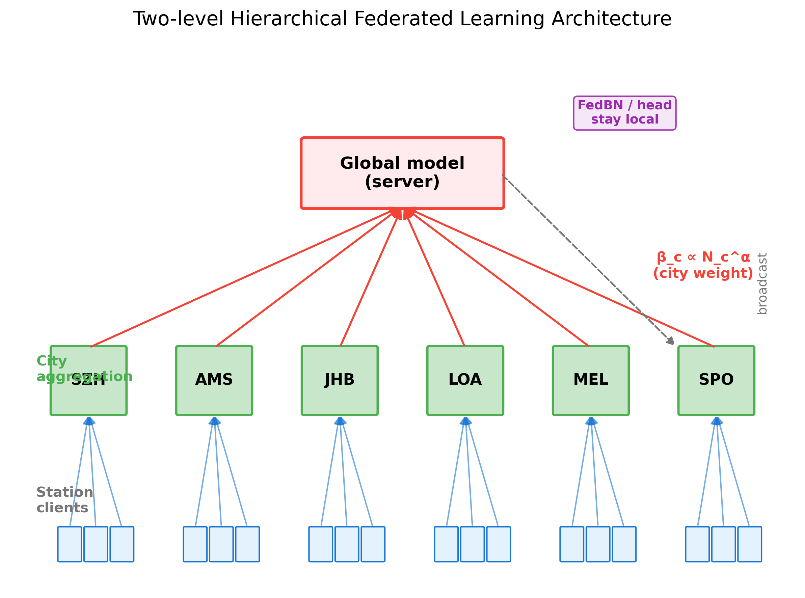
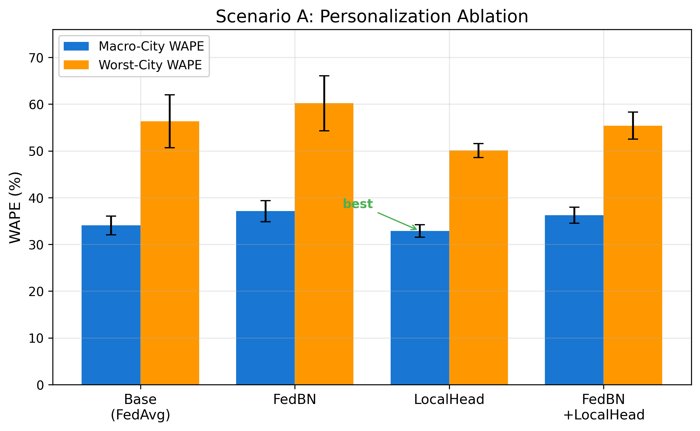
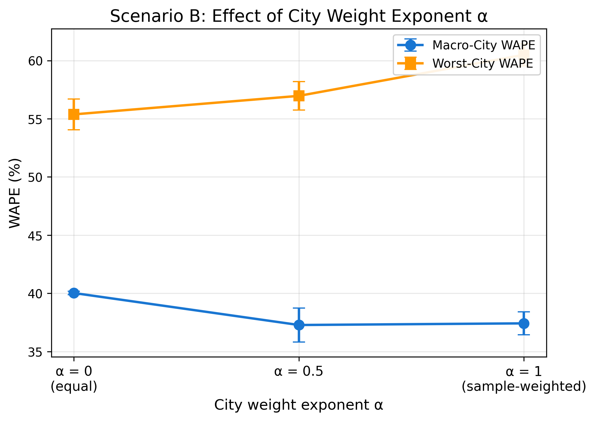
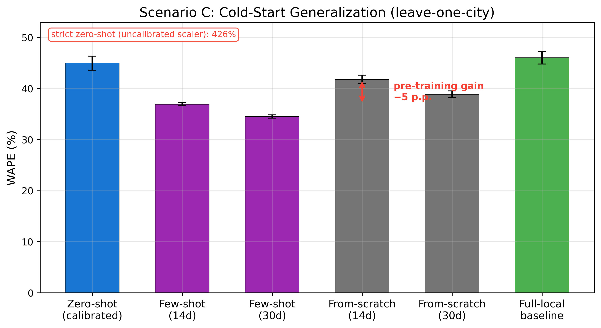

# 基于分层联邦学习的多城市电动汽车充电负荷预测

---

## 摘要

电动汽车充电负荷预测，说到底是为了让充电桩往哪儿布、电网怎么调更有依据。可现实存在的问题是：充电站的数据散落在各家运营商、各个城市手里，想集中起来训一个模型，既有隐私侵犯问题，而且不同城市的充电行为相差很大，且数据量不均衡。

针对这个局面，本文提出一种两层分层联邦学习框架：先在站级和城市级之间做两级聚合，再用城市样本量的指数 α 来调节每个城市在全局模型里的话语权，避免大城市的权重过高；同时，在全局共享的 TCN-LSTM 主干之上，用 FedBN 和本地预测头两种机制做个性化，尽量压住跨城市的负迁移。在 CHARGED 六城市数据集上，我们设计了三组实验把想法逐条验证：（A）平衡采样下的个性化消融；（B）自然不均衡分配下的城市加权指数扫描；（C）留一城市的冷启动泛化。

结果主要有三点。其一，FedBN 和本地预测头这两种轻量个性化机制在我们这套协议和模型下都没占到便宜——平均精度上纯分层 FedAvg（Base）反而是最优（33.68%），本地预测头（34.37%）与它几乎打平、FedBN 明显更差（36.90%），最差城市上各方法也都落在跨种子噪声范围内。其二，在自然不均衡分配下，α 是个不折不扣的「精度—公平性」权衡旋钮：α=0.5 精度最好（37.28%），α=0 公平性最好（最差城市 55.38%），而 α=1（也就是标准的样本加权 FedAvg）精度虽然贴得很近，公平性却最难看（60.49%）。其三，冷启动的头号拦路虎是「数据尺度/归一化的不对齐」，而不是「模型参数迁移不了」：严格零样本（scaler 用其余 5 城、不校准）在小城市上会飙到 SPO 1246%、JHB 139.9%，但只要换成留出城市自身的归一化统计、模型权重一个不动、零训练，就掉到 49.15%——这一步 224 点的收益证明预训练主干本身是能跨城复用的；在此之上再做 30 天少样本微调，再降约 11 点（38.32%）。不过迁移的边际价值随本地数据量递减：few-shot 对从头训练（38.87%）只差 0.55 点，且四个数据稀缺小城迁移一致正向、两个数据富集城市（SZH/AMS）反而受损。

**关键词**：联邦学习；电动汽车；负荷预测；分层聚合；个性化；冷启动

---

## 1 引言

电动汽车铺开的速度比很多人预想的快，充电负荷在电网里的分量也跟着水涨船高。负荷预测准不准，直接关系到充电桩往哪儿摆、配电网要不要扩容、削峰填谷怎么调。但充电负荷预测有两个绕不开的现实问题：

1. **数据孤岛与隐私**：充电站的数据分散在不同运营商、不同城市，出于隐私和商业上的顾虑，原始数据很难集中到一台服务器上。
2. **跨城市数据异质性**：不同城市的充电习惯差异很大：阿姆斯特丹和约翰内斯堡的日负荷曲线、24 小时自相关性（0.89 和 0.69）就明显不是一个路子；数据量也严重不均，深圳（约 1347 个有效站点）加上阿姆斯特丹（约 1083 个）就占掉了全部有效数据的约 92%（2430/2636），约翰内斯堡、墨尔本、圣保罗这些城市只有几十个有效站点。

联邦学习（Federated Learning, FL）让各参与方在本地训练、只交换模型参数，不共享原始数据也能协同学习，正好对上了「数据留在本地」这个诉求。这里先把话说清楚：本文实现的是**单进程联邦仿真**——所有城市的数据在同一进程内按「逻辑分区」模拟各客户端本地训练、只交换模型参数（不共享原始数据），并非跨进程/跨机器的真实分布式部署；也没有上差分隐私或安全聚合，所以只声称 privacy-aware，不声称任何可证明的隐私保护。但标准的 FedAvg 拿到跨城市 Non-IID 加样本不均衡的场景里，会露出两个明显的短板：一是按样本量加权聚合，深圳这种「数据大户」会把全局模型整个带走，小城市的精度和公平性跟着遭殃；二是单一全局模型很难同时适配各城市各异的负荷模式，负迁移说来就来。

围绕这些问题，本文做了三件事：

1. **提出两层分层联邦聚合框架**：先在城市内部做站点级聚合，再在城市之间做全局聚合，用城市样本量的指数 α 来控制城市权重（β_c ∝ N_c^α），在「精度」和「公平性」之间留出一个可调的折中档位，避免大数据城市一家独大。
2. **引入个性化机制缓解负迁移**：在全局共享的 TCN-LSTM 主干之上，分别考察 FedBN（BN 统计量本地化）和本地预测头（预测头不参与全局聚合）两种轻量个性化手段，并系统性地做消融。
3. **系统验证三种现实场景**：平衡采样（场景 A）、自然不均衡分配（场景 B）、留一城市冷启动（场景 C），把「数据怎么选」「城市怎么加权」「新城市怎么接入」这三个实际问题挨个过了一遍。

---

## 2 相关工作

**EV 负荷预测**：这条线起步时多是统计方法（ARIMA、指数平滑），最近几年深度学习成了主流：长短期记忆网络（LSTM）[1] 擅长建模长期依赖，时序卷积网络（TCN）[2] 靠空洞因果卷积抓多尺度局部时序模式，Transformer [3] 用自注意力机制在序列建模上表现抢眼。具体到充电负荷预测，TCN-LSTM 这种混合结构已有人验证过稳定性 [4]；针对充电负荷的综述 [5] 也印证了这一趋势。本文就沿用了这个骨干。

**联邦学习与个性化**：联邦平均（FedAvg）[6] 让各客户端本地训练、只聚合模型参数，但在数据异质性强的时候会掉链子。后来的工作提了不少补丁：FedProx [7] 加近端项约束本地更新，FedBN [8] 把 BN 统计量留在本地、只共享卷积/线性层参数；**本地预测头**（FedPer [9]，只共享特征提取主干、各自保留回归头）是另一种更轻的个性化路子。在架构上，Client-Edge-Cloud 分层联邦 [11] 已证明「端—边—云」多级聚合能兼顾通信开销与模型质量，本文的「站—城—全局」两级聚合正是同一思路在跨城市充电负荷上的实例化；在公平性上，Agnostic FL [12] 把最坏客户分布纳入优化目标，本文用城市权重指数 α 显式调节精度—公平性权衡，可看作这一思路的轻量工程化实现。本文把 FedBN 和本地预测头放到跨城市充电负荷这个具体场景里做对比消融。

**跨城市/冷启动**：新城市加入时没标签或标签极少，怎么让它接得上已有的联邦模型，是实际落地的痛点。少样本/元学习的方法（MAML [10]）给「用极少数据快速适应」提供了方法基础。本文用留一城市实验，评估预训练模型的零样本（zero-shot）、少样本（few-shot）迁移能力，再跟从头训练对照，量化预训练知识到底值多少。

---

## 3 方法

### 3.1 问题定义与数据集

给定某站点连续 T 小时的负荷序列，我们希望利用过去 L=168 小时（7 天）的历史窗口，预测未来 H=24 小时（1 天）的充电负荷。训练样本通过滑动窗口构造，预测目标为标准化后的充电量。

本文使用 **CHARGED 数据集**（Guo et al., "A City-scale and Harmonized Dataset for Global Electric Vehicle Charging Demand Analysis", *Scientific Data*, 2025, DOI: 10.1038/s41597-025-05584-7；仓库 github.com/IntelligentSystemsLab/CHARGED），覆盖 6 座城市 2023 年 4–9 月共约 6 个月、每小时粒度的充电记录，城市与有效站点数如下：

| 城市 | 代码 | 原始站点 | 有效站点 | 24h 自相关 | 168h 自相关 |
|---|---|---|---|---|---|
| 深圳 | SZH | 1379 | ~1347 | 0.70 | 0.50 |
| 阿姆斯特丹 | AMS | 1388 | ~1083 | 0.89 | 0.69 |
| 约翰内斯堡 | JHB | 35 | ~28 | 0.69 | 0.19 |
| 洛杉矶 | LOA | 224 | ~139 | 0.63 | 0.64 |
| 墨尔本 | MEL | 62 | ~22 | 0.50 | 0.26 |
| 圣保罗 | SPO | 41 | ~17 | 0.80 | 0.34 |

每个站点包含充电量（预测目标）及多源特征：7 维气象、6 维电价（2 维原始 + 4 维标准化衍生）、7 维时间循环编码与周末标记、3 维滞后特征、6 维滚动统计、2 维站点静态属性、1 维负荷归一化、5 维缺失标记。经时区对齐、电价/负荷归一化与特征工程后，构造 **38 维输入特征**（1 维目标 + 37 维特征）。数据按 7:1.5:1.5 划分训练/验证/测试集。

### 3.2 TCN-LSTM 骨干网络

预测模型采用 TCN-LSTM 混合结构：

- **TCN 部分**：3 个因果空洞卷积块，通道数均为 64，卷积核大小 3，空洞率依次为 1/2/4，每块含批归一化（BN）、ReLU 激活与残差连接，用于提取多尺度局部时序模式；
- **LSTM 部分**：隐藏层维度 64、2 层，用于捕捉长期依赖；
- **预测头**：全连接层（64→64→ReLU→Dropout(0.1)→24），输出未来 24 小时负荷。

模型走的是轻量路线，可训练参数量 **144,664**（约 14.5 万）：TCN 72,384 + LSTM 66,560 + 预测头 5,720，放充电站端这种资源受限的地方本地训练也扛得住。

### 3.3 两层分层联邦聚合与城市加权

联邦训练在「站级客户端 → 城市 → 全局」三个层级上展开：

1. **站级本地更新**：每个站点作为一个客户端，用本地数据对全局下发模型做若干轮本地训练（本地 epoch 数 E=5），得到局部更新。
2. **城市内聚合**：先对同一城市内的站点更新做聚合，得到该城市的城市模型；
3. **城市间全局聚合**：各城市模型按权重 β_c 加权平均，得到新一轮全局模型：

$$ \beta_c \propto N_c^{\alpha} $$

其中 N_c 为城市 c 的有效站点数（或样本数），α ∈ [0, 1] 为**城市权重指数**。α=0 时各城市等权，α=1 时退化为按样本量加权的标准 FedAvg（深圳主导）。转动这个 α，就能在「整体精度」和「小城市公平性」之间找一个折中点。

客户端本地更新默认用 **FedAvg**（Adam 优化器，weight_decay=1e-5，梯度裁剪 norm=5.0）；冷启动场景（场景 C）里额外引入 **FedProx** 近端项（系数 μ=0.01）约束本地更新、增强跨城市泛化。二者服务器端都是上面这套城市平衡加权平均，差别只在客户端近端项开关（μ），具体见 4.2 节。

### 3.4 个性化机制：FedBN 与本地预测头

为了缓解跨城市负迁移，本文考察两种轻量个性化机制：

- **FedBN**：把 TCN 各块的 BN 层（含 running mean/var 统计量）留在各站点本地、不参与全局聚合，让每个站点保留各自的归一化统计特性。
- **本地预测头（LocalHead）**：只共享 TCN-LSTM 特征提取主干，预测头（最后的全连接层）留在各站点本地、不参与聚合。

两种机制可以单独用，也可以叠加，凑成 4 种消融配置。

### 3.5 冷启动评估协议

针对「新城市加入」的冷启动场景，本文用留一城市协议：每次留出 1 座城市当测试，用其余 5 城训练一个可迁移的全局模型（这里用 FedProx、近端系数 μ=0.01、城市权重 α=0.5，增强泛化），然后在这个留出城市上依次评估：

- **Zero-shot（零样本）**：直接用全局模型预测，不做任何微调；同时把**严格零样本**（scaler 仅由其余 5 城训练前缀拟合）和**校准零样本**（scaler 用留出城市自身统计拟合，严格讲不算零样本）两套协议分开报告；
- **Few-shot（少样本）**：用留出城市**紧邻测试期**的最近 N 天（14/30 天）数据微调后预测（把原协议里和测试期之间的验证间隔抹掉）；为防小样本过拟合，微调 epoch 随窗口数自适应（保持总梯度步数恒定）；
- **From-scratch（从头训练）**：用同样 N 天数据从随机初始化训练，作为「无预训练」对照；
- **Full-data local baseline（全量本地基线）**：用留出城市全量数据本地训练，作为性能参考（在部分城市它反而不如零样本，所以不叫「oracle」）。

---

## 4 实验设置

### 4.1 数据与预处理

六城市统一预处理：按城市时区对齐时间戳、电价城市内标准化、负荷归一化（去除量纲差异），对恒定值/异常大值/高零值站点做清洗。客户端站点选择用了三种策略：

- **分层平衡采样（stratified_balanced）**：每城等量选 9 个站点（6×9=54 个客户端），保证各城市在训练里均衡参与，对应场景 A；
- **比例分配（proportional）**：按各城市有效站点数比例分配 60 个客户端（AMS 27、SZH 21、LOA 5、JHB 3、MEL 2、SPO 2），还原自然不均衡，对应场景 B。

### 4.2 三种实验场景

- **场景 A（个性化消融）**：分层平衡采样 + FedAvg（μ=0）+ 城市平衡（α=0），对比 {Base、+FedBN、+LocalHead、+FedBN+LocalHead} 四种配置；
- **场景 B（城市加权扫描）**：比例分配 + FedAvg（μ=0）+ 城市平衡，扫描 α ∈ {0, 0.5, 1.0}；
- **场景 C（冷启动）**：留一城市 + FedProx（μ=0.01）+ 城市平衡（α=0.5），评估 zero-shot / few-shot / from-scratch / full-local。

### 4.3 基线方法

- **centralized_personalized**：集中训练但每城独立预测头（数据集中、不具隐私优势，精度上界参考之一）；
- **centralized_shared**：每城把所有站点数据合并、集中训练单一共享模型，再跨城等权平均（无跨城数据共享）；
- **local_only**：各站只用本地数据孤立训练（无协作）；
- **seasonal_naive**：季节朴素预测（基于历史同期负荷）。

### 4.4 评价指标

以 **Macro-City WAPE（先对每城市内站点 WAPE 取等权平均，再对城市取等权平均）** 为主指标，避免大城市的样本数主导；同时报告**最差城市 WAPE**（公平性指标，衡量最差城市的服务能力）与单城市 WAPE。作为补充，另报告 **micro-WAPE**（把所有站点合并成一个大池后整体计算，等价于按样本量加权）以对照两种口径的差异。所有 FL 实验取 3 个随机种子（42/123/999）的均值±标准差。

### 4.5 超参数

联邦通信轮次 R=50（场景 C 为 30），本地 epoch E=5，学习率 1e-3，批大小 64，预测窗口 24 小时，输入窗口 168 小时。聚合方法：场景 A/B 为 FedAvg（μ=0），场景 C 为 FedProx（近端系数 μ=0.01）；场景 C 的全局模型训练轮次为 30、few-shot 微调学习率 1e-4。

---

## 5 结果与分析

### 5.1 场景 A：个性化消融

| 配置 | Macro-City WAPE (%) | 最差城市 WAPE (%) |
|---|---|---|
| **FedAvg（基线）** | **33.68 ± 1.56** | 55.65 ± 4.70 |
| + FedBN | 36.90 ± 2.18 | 60.51 ± 6.89 |
| + LocalHead | 34.37 ± 2.10 | **55.20 ± 5.57** |
| + FedBN + LocalHead | 35.89 ± 2.31 | 56.53 ± 5.44 |

本场景的聚合方法为 FedAvg（μ=0）。**结论**：在这套协议与模型下，两种轻量个性化机制都**没有带来显著增益**——纯分层 FedAvg（Base）反而拿下最优平均精度（33.68%）。本地预测头（LocalHead）平均精度 34.37%，比 Base 略差 0.7 个百分点，最差城市（55.20%）比 Base（55.65%）改善 0.45 个百分点，两项都落在跨种子标准差（1.56–2.10 / 4.70–5.57）以内，只能算「中性」。FedBN 明显更差（36.90%，平均精度劣化约 3.2 个百分点），一个可能的解释是：跨城市场景下把 BN 统计量留在各站点本地继续更新、不参与全局聚合，反而让全局分布信息在各站点之间失去共享。两者叠加（+FedBN+LocalHead，35.89%）也没带来额外收益，反而介于两者之间、偏坏。

### 5.2 场景 B：城市加权指数扫描

| α | 城市权重含义 | Macro-City WAPE (%) | 最差城市 WAPE (%) |
|---|---|---|---|
| 0 | 城市等权 | 40.03 ± 0.15 | **55.38 ± 1.32** |
| **0.5** | **折中** | **37.28 ± 1.46** | 56.97 ± 1.22 |
| 1 | 样本量加权 | 37.42 ± 0.99 | 60.49 ± 0.95 |

**结论**：在自然不均衡分配下，城市权重指数 α 在「精度」和「公平性」之间是个**权衡**，而不是谁单调占优。α=0.5 精度最好（37.28%），α=0 公平性最好（最差城市 55.38%），而 α=1（数学上退化成标准样本加权 FedAvg）精度贴得近（37.42%），公平性却最差（最差城市 60.49%，比 α=0 恶化约 5 个百分点）。说白了，按样本量加权的标准 FedAvg 让深圳这类数据大户主导全局模型，代价就是最差城市的服务能力被牺牲掉；α 这个旋钮，提供的是从「城市等权（α=0，偏公平）」到「样本加权（α=1，偏大城精度）」之间的一段连续调节。

### 5.3 场景 C：冷启动泛化

| 方法 | 平均 WAPE (%) |
|---|---|
| strict zero-shot（严格零样本，scaler 不校准） | 273.6 |
| calibrated zero-shot（校准零样本） | 49.15 |
| Few-shot（14 天） | 39.97 |
| **Few-shot（30 天）** | **38.32** |
| From-scratch（14 天） | 41.81 |
| From-scratch（30 天） | 38.87 |
| Full-data local baseline | 39.31 |

**结论**：（1）**冷启动的头号杀手是「尺度不对齐」，不是「模型参数迁移不了」**：strict zero-shot（scaler 由其余 5 城拟合、不校准）在 SPO 上飙到 1246%、JHB 139.9%、LOA 92.7%，把均值拉到 273.6%；而 calibrated zero-shot 只是把 scaler 换成留出城市自身的归一化统计——**模型权重一个不动、零梯度训练**——就降到 49.15%。两者只差「用谁的数据算均值/方差」，就差了 224 点，说明预训练主干本身是能跨城复用的，真正的卡点在数据尺度。（2）**预训练迁移只在数据极少时值钱**：在已校准的基础上做 30 天少样本微调，再降约 11 点（49.15→38.32），这部分吃的是预训练主干的通用时序知识。（3）**数据一够，迁移的边际价值趋近于零、甚至转负**：few-shot（38.32%）对 from-scratch（38.87%）只差 0.55 点；分城市看更清楚——JHB/LOA/MEL/SPO 四个数据稀缺小城上 few-shot 一致优于 from-scratch（5–10 点），而 SZH/AMS 两个数据富集城市反而受损（SZH from-scratch 38.1 vs few-shot 59.9，差 22 点）。这与「迁移学习在低资源场景收益最大、高资源时边际递减甚至为负」的规律一致。

### 5.4 与基线对比

> ⚠️ **基线口径提示**：下列基线已统一为 Macro-City（每城等权）口径；但单城市基线（seasonal_naive / local_only / centralized_shared）为各城 `top_k=9`（按电量 top-9）独立训练后跨城宏平均，其站点集合与 FL 场景 A（分层平衡采样）不完全一致，且 ± 为**跨 6 城标准差**（非 3-seed 标准差）；centralized_personalized 为多城集中训练（分层平衡 9 站/城）。故基线仅作**参考对照**，不与 FL 做严格同口径并列比较。

| 方法 | Macro-City WAPE (%) |
|---|---|
| **分层联邦（本文，Base）** | **33.68 ± 1.56** |
| centralized_personalized（集中训练、每城独立头） | 35.55 ± 2.72 |
| seasonal_naive（季节朴素） | 35.21 ± 15.12 |
| local_only（各站孤立训练） | 44.54 ± 14.18 |
| centralized_shared（集中共享模型） | 47.94 ± 13.69 |

本文的分层联邦（33.68%）跑赢了所有基线：集中训练个性化（35.55%）、季节朴素（35.21%）、本地孤立训练（44.54%）和集中共享模型（47.94%）。有意思的是，seasonal_naive 作为不用训练的朴素基线已经相当能打（35.21%），只比本文最优（33.68%）差约 2.5 个百分点；local_only / centralized_shared 则明显更差（44.54% / 47.94%），从侧面说明跨城市协作带来的知识共享确实有用。这里再强调一次口径差异：单城市基线的站点集合（top-9 按电量）与 FL 场景 A（分层平衡）不一致，其 ± 是跨城标准差。另外，本文没有单独做「单城市 FL」（只在同一城市内部做站级联邦、不做跨城聚合）这一消融，它本可以把跨城协作的收益从站级联邦里单独拆出来，但小城市站点过少（SPO 约 17 站、JHB 约 28 站）且单城市脚本口径为 FedProx 而非正文的 FedAvg，难以严格对照，故留作未来工作。

### 5.5 讨论

- **为什么 LocalHead / FedBN 都没带来显著收益**：预测头直接决定输出尺度和城市专属的负荷水平，本地化从道理上能避免被其他城市「平均」掉；但在我们的「站级—城市级—全局」两层聚合里，站级客户端数量充足（每城 9 站、共 54 站），全局主干已经通过城市等权聚合学到了各城共性的时序模式，把预测头本地化能多保留的那点「城市专属」信息被跨种子方差淹没了——LocalHead 均值只比 Base 差 0.7 点、最差城市改善 0.45 点，都在噪声内。BN 统计量在跨城市场景里更关键——它携带着全局分布信息，本地化（留在各站点、不参与全局聚合）反而丢了这块，所以 FedBN 明显变差（约 +3.2 点）。
- **为什么冷启动卡在「尺度」而非「模型参数」**：strict zero-shot 与 calibrated zero-shot 用的是同一个预训练主干、同样零训练，唯一差别是 scaler 来自 5 城还是留出城自身，结果就差了 224 点（SPO 1246→47.7、JHB 139.9→34.8）。这说明预训练模型学到的是「负荷随时间的相对变化模式」，这部分跨城市是通的；不通的是各城负荷的绝对水平与量纲，而后者恰恰由归一化统计量决定。至于 few-shot 对 full-local 只领先不到 1 点，是因为修正后的 full-local（85% 数据 + 早停）本身已经吃到了本地数据的全部红利，预训练迁移的增量空间被压得很小——而且从逐城看，这个增量对数据富集的大城（SZH/AMS）是负的、对小城（JHB/LOA/MEL/SPO）才是正的。
- **关于 FedAvg/FedProx 的使用**：场景 A/B 侧重个性化和加权消融，用标准 FedAvg（μ=0）好隔离变量；场景 C 侧重跨城市迁移泛化，改用 FedProx（μ=0.01）增强全局模型的通用性。两者共享同一套城市平衡聚合服务器，差别只在客户端近端项开关。这是有意的设计选择，不是口径不统一。
- **局限与展望**：当前每城选取的站点数有限（场景 A 每城 9 站、场景 C 每城 10 站）、数据仅 6 个月，后面可以拉到更长周期、更多城市，也可以再琢磨更细的个性化（比如每城市独立学习率、元学习初始化）。

---

## 6 结论

本文面向跨城市电动汽车充电负荷预测，提出两层分层联邦学习框架，通过「站级—城市级—全局」两级聚合与城市权重指数 α 来平衡精度和公平性，并考察 FedBN / 本地预测头两种个性化机制。在 CHARGED 六城市数据集上的三组实验，给出了三条站得住的结论：

1. 在本实验协议与模型下，FedBN 与本地预测头两种轻量个性化机制均未带来显著增益：纯分层 FedAvg（Base）平均精度最优（33.68%），LocalHead 与它几乎打平、FedBN 明显变差，最差城市上各方法也都落在跨种子噪声内；
2. 自然不均衡分配下，α 在精度与公平性之间呈权衡：α=0.5 最优精度（37.28%）、α=0 最优公平性（55.38%），标准样本加权 FedAvg（α=1）精度接近但公平性最差（60.49%）；
3. 冷启动的头号杀手是数据尺度不对齐而非模型参数迁移：严格零样本（不校准 scaler）在小城市飙到 1246%（SPO）/139.9%（JHB），仅换目标城自身归一化统计、权重零改动即降到 49.15%（降 224 点）；再经 30 天少样本微调降约 11 点（38.32%）。迁移的边际价值随本地数据量递减——四个小城迁移正向、两个数据富集城市（SZH/AMS）反而受损。

这几条结论，为「多城市、数据异质、数据本地化受限」的充电负荷预测提供了一个可落地、可解释的联邦学习实证方案。最后还得把边界说清楚：本文实现的是单进程联邦仿真（逻辑分区、只交换模型参数，不共享原始数据），并非跨机器真实分布式部署；也没引入差分隐私或安全聚合，所以只声称 privacy-aware，不声称可证明的隐私保护。

---

## 参考文献

[1] S. Hochreiter, J. Schmidhuber. Long Short-Term Memory. *Neural Computation*, 9(8): 1735–1780, 1997. DOI: 10.1162/neco.1997.9.8.1735.

[2] S. Bai, J. Z. Kolter, V. Koltun. An Empirical Evaluation of Generic Convolutional and Recurrent Networks for Sequence Modeling. arXiv:1803.01271, 2018.

[3] A. Vaswani, N. Shazeer, N. Parmar, J. Uszkoreit, L. Jones, A. N. Gomez, L. Kaiser, I. Polosukhin. Attention Is All You Need. *Advances in Neural Information Processing Systems (NeurIPS)*, 2017.

[4] J. Tian, H. Liu, W. Gan, Y. Zhou, N. Wang, S. Ma. Short-term electric vehicle charging load forecasting based on TCN-LSTM network with comprehensive similar day identification. *Applied Energy*, 2025. DOI: 10.1016/j.apenergy.2024.125174.

[5] M. Alaraj, M. Radi, E. Alsisi, M. Majdalawieh, M. Darwish. Machine Learning-Based Electric Vehicle Charging Demand Forecasting: A Systematized Literature Review. *Energies*, 2025. DOI: 10.3390/en18174779.

[6] B. McMahan, E. Moore, D. Ramage, S. Hampson, B. Agüera y Arcas. Communication-Efficient Learning of Deep Networks from Decentralized Data. *Proceedings of AISTATS*, 2017.

[7] T. Li, A. K. Sahu, M. Zaheer, M. Sanjabi, A. Talwalkar, V. Smith. Federated Optimization in Heterogeneous Networks. *Proceedings of MLSys*, 2020.

[8] X. Li, M. Jiang, X. Zhang, M. Kamp, Q. Dou. FedBN: Federated Learning on Non-IID Features via Local Batch Normalization. *Proceedings of ICLR*, 2021.

[9] M. G. Arivazhagan, V. Aggarwal, A. K. Singh, S. Choudhary. Federated Learning with Personalization Layers. arXiv:1912.00818, 2019.

[10] C. Finn, P. Abbeel, S. Levine. Model-Agnostic Meta-Learning for Fast Adaptation of Deep Networks. *Proceedings of ICML*, 2017.

[11] L. Liu, J. Zhang, S. H. Song, K. B. Letaief. Client-Edge-Cloud Hierarchical Federated Learning. arXiv:1905.06641, 2019.

[12] M. Mohri, G. Sivek, A. T. Suresh. Agnostic Federated Learning. *Proceedings of the 36th International Conference on Machine Learning (ICML)*, PMLR 97: 4615–4625, 2019.

---

## 待确认/待补充清单（审查用）

- [x] ~~CHARGED 数据集引用~~（已补：Guo et al., "A City-scale and Harmonized Dataset for Global Electric Vehicle Charging Demand Analysis", *Scientific Data*, 2025, DOI: 10.1038/s41597-025-05584-7；仓库 github.com/IntelligentSystemsLab/CHARGED）。
- [x] ~~模型精确参数量、输入特征维度~~（已核对：可训练参数 144,664，input_dim=38，六城一致）。
- [x] ~~第 2 节相关工作补入具体文献引用~~（已补：12 篇，经四索引（Crossref/OpenAlex/Semantic Scholar/arXiv）校验 `lookup_verified=true`，见文末「参考文献」；其中 [11] Client-Edge-Cloud 分层联邦与 [12] Agnostic FL 为本轮新增）。
- [x] ~~单城市 6 城结果~~（决定不加入正文/附录：本轮未重跑单城市 FL，小城市站点过少、单城市脚本口径为 FedProx 非 FedAvg，无法严格对照；正文 5.4 已注明留作未来工作）。
- [x] ~~图~~（已补：图 1 架构示意、图 2 场景 A、图 3 场景 B、图 4 场景 C，见 `paper/figures/`）。
- [x] **可复现性（#14）**：P0 缺陷已修复（缓存键加城市集合、checkpoint 快照本地 BN/头、选轮改主指标、参考 scaler 统一、full-local 85%+早停）并完成全量重跑；新的可复现 commit hash 为 `ab40131`；依赖已锁定 `requirements.txt`（7 项全 `==`）；FL run 站点 ID 清单在 `outputs/station_lists/*.json`，单城市基线/留一城市为确定性 top-k 选站、可从各 run `metrics.json` 站点键恢复；`organize_results.py` 输出逐 seed 原始 RMSE/WAPE 与最差城市 WAPE，`leave_one_out.py` 输出逐城市原始 WAPE。
- [x] **重跑后更新数字**：已用 P0 修复后的重跑结果（`results/leave_one_out_3seed.json`、`results/organized_results.json`，时间戳 2026-08-30）替换正文各表（摘要、§5.1 场景 A、§5.3 场景 C、§5.4 基线、§5.5 讨论、§6 结论）与 `results/` 的可信数字。

> **本次可复现 commit hash**：`ab40131`（本轮 P0 修复 + 重跑代码提交）。上一轮（P0 修复前）的可复现引用 `13dafe3` 已作废：本轮 `src/federated/trainer.py`（缓存键加城市集合、checkpoint 快照本地 BN/头、选轮改主指标）与 `experiments/leave_one_out.py`（参考 scaler、few-shot/full-local 协议）均有改动，旧结果被 P0 缺陷污染，不再作为可复现基线。
